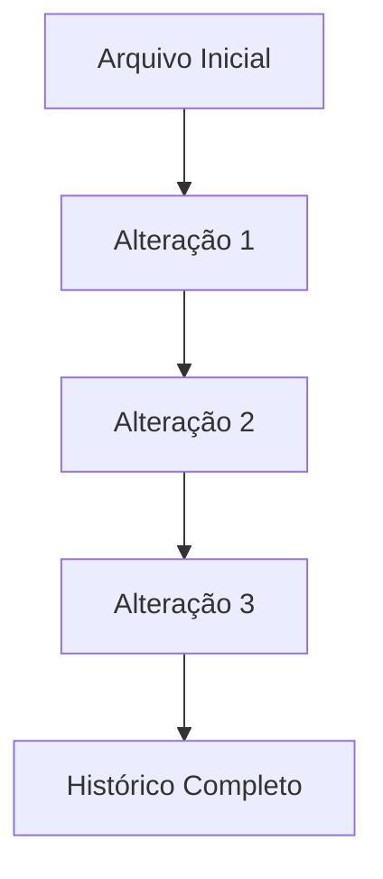

# Aula 01 – Por que o Git Existe?

## 📚 Disciplina

Versionamento de Código com Git e GitHub

## 🎓 Curso

Técnico em Desenvolvimento de Sistemas

## ⏱️ Duração

40 minutos

## 🚀 Projeto Integrador

Meu Manual de Git e GitHub

---

# 🎯 Objetivos da Aula

Ao final desta aula você deverá ser capaz de:

* Compreender o que é versionamento.
* Identificar problemas causados pela falta de controle de versões.
* Entender por que o Git foi criado.
* Reconhecer a importância do Git no mercado de trabalho.
* Criar sua conta no GitHub.
* Iniciar seu Projeto Integrador.

---

# 🤔 Por Que Aprender Isso?

Imagine a seguinte situação:

Você está desenvolvendo um trabalho importante da escola.

Durante vários dias você faz alterações e salva arquivos com nomes como:

```text
trabalho.docx

trabalho_final.docx

trabalho_final_agora_vai.docx

trabalho_final_definitivo.docx

trabalho_final_definitivo_v2.docx

trabalho_final_definitivo_v2_agora_vai.docx
```

Após uma semana você precisa recuperar uma informação que existia em uma versão anterior.

Mas surge uma dúvida:

> Qual arquivo possui a versão correta?

Agora imagine que esse trabalho está sendo realizado por cinco pessoas ao mesmo tempo.

Quem alterou o quê?

Quando alterou?

Por que alterou?

Qual é a versão mais atual?

Como recuperar uma versão anterior?

Esses problemas acontecem diariamente em empresas de tecnologia.

Foi justamente para resolver situações como essas que surgiu o versionamento de código.

---

# 📖 O Que É Versionamento?

Versionamento é o processo de registrar, organizar e controlar alterações realizadas em arquivos ao longo do tempo.

Em vez de criar dezenas de arquivos com nomes diferentes, um sistema de versionamento mantém um histórico organizado de todas as mudanças realizadas.

---

## Exemplo Simples

Sem versionamento:

```text
trabalho.docx
trabalho_final.docx
trabalho_final2.docx
trabalho_final_agora_vai.docx
```

Com versionamento:

```text
Versão 1
↓
Versão 2
↓
Versão 3
↓
Versão 4
```

Tudo organizado em um único histórico.

---

# 🧠 Conceitos Importantes

## 📌 Histórico

Permite saber todas as alterações realizadas.

---

## 📌 Rastreabilidade

Permite identificar:

* Quem realizou uma alteração;
* Quando realizou;
* O que foi alterado.

---

## 📌 Recuperação

Permite voltar para versões anteriores.

---

## 📌 Colaboração

Permite que várias pessoas trabalhem no mesmo projeto.

---

# ⚙️ Como Funciona?

A ideia do versionamento pode ser representada da seguinte forma:



Cada alteração passa a fazer parte do histórico do projeto.

Nada é perdido.

Tudo fica registrado.

---

# 🚨 Problemas que o Git Resolve

## Problema 1

Perda de Arquivos

Exemplo:

Você apagou um arquivo importante sem querer.

---

## Problema 2

Versões Confusas

Exemplo:

```text
projeto.docx

projeto_final.docx

projeto_final2.docx

projeto_final_definitivo.docx
```

---

## Problema 3

Trabalho em Equipe

Exemplo:

Duas pessoas alteram o mesmo arquivo simultaneamente.

Qual versão deve ser utilizada?

---

## Problema 4

Falta de Histórico

Exemplo:

Um erro apareceu no sistema.

Quem alterou o código?

Quando?

Por quê?

---

# 💼 Git no Mercado de Trabalho

Atualmente, praticamente toda empresa de desenvolvimento utiliza algum sistema de versionamento.

Exemplos:

* Google
* Microsoft
* Amazon
* Netflix
* Spotify
* Nubank
* Mercado Livre
* iFood

Independentemente da linguagem utilizada, o Git tornou-se um padrão da indústria.

Por isso, aprender Git não é apenas aprender uma ferramenta.

É aprender uma prática profissional.

---

# 📜 A História do Git

Em 2005, Linus Torvalds, criador do Linux, precisava de uma ferramenta eficiente para controlar milhares de alterações realizadas por desenvolvedores espalhados pelo mundo.

A solução criada recebeu o nome de:

# Git

Desde então, tornou-se o sistema de controle de versão mais utilizado no planeta.

---

# 🔍 Git x GitHub

Muitos iniciantes acreditam que Git e GitHub são a mesma coisa.

Mas não são.

| Git                         | GitHub                          |
| --------------------------- | ------------------------------- |
| Ferramenta de versionamento | Plataforma de hospedagem        |
| Funciona no computador      | Funciona na internet            |
| Controla alterações         | Armazena repositórios           |
| Gratuito e Open Source      | Possui planos gratuitos e pagos |

---

# 📝 Exemplo do Cotidiano

Imagine um jogo de videogame.

Você salva o progresso em vários momentos.

Se algo der errado, pode voltar ao ponto salvo anteriormente.

O Git funciona de forma parecida.

Cada alteração importante gera um novo ponto de recuperação.

---

# 🛠️ Mão na Massa

## Atividade Prática

### Passo 1

Acesse:

https://github.com

---

### Passo 2

Crie sua conta utilizando um e-mail válido.

---

### Passo 3

Configure:

* Nome de usuário;
* Foto de perfil (opcional);
* E-mail de recuperação.

---

### Passo 4

Explore a página inicial do GitHub.

Observe:

* Repositórios;
* Perfis;
* Projetos públicos.

---

### Resultado Esperado

Ao final da atividade você deverá possuir uma conta GitHub criada e funcional.

---

# 🚀 Desafio da Aula

Responda com suas palavras:

### Pergunta 1

Por que salvar vários arquivos com nomes diferentes não é uma boa estratégia para controlar versões?

---

### Pergunta 2

Qual problema do cotidiano o Git resolve?

---

### Pergunta 3

Por que empresas utilizam sistemas de versionamento?

---

# 📌 Atualizando Meu Manual de Git e GitHub

Nesta primeira aula ainda não iremos utilizar comandos Git.

Porém você deverá criar um documento contendo suas anotações.

Estrutura sugerida:

```text
Aula 01

- O que é versionamento
- O que é histórico
- O que é rastreabilidade
- Por que o Git foi criado
```

Essas anotações serão utilizadas futuramente em seu repositório.

---

# 📚 Resumo da Aula

Nesta aula aprendemos:

✅ O que é versionamento.

✅ O que é histórico de alterações.

✅ O que é rastreabilidade.

✅ Problemas resolvidos pelo Git.

✅ Diferença entre Git e GitHub.

✅ A importância do Git no mercado de trabalho.

✅ Como criar uma conta GitHub.

---

# 🔗 Preparando-se para a Próxima Aula

Na próxima aula conheceremos melhor o GitHub.

Vamos entender:

* O que é um repositório;
* Como funciona um perfil profissional;
* Como o GitHub pode ser utilizado como portfólio;
* Por que recrutadores analisam perfis GitHub durante processos seletivos.

---

[🏠 Início](../README.md) | [⏩ Próxima Aula – Aula 02](aula02.md)
