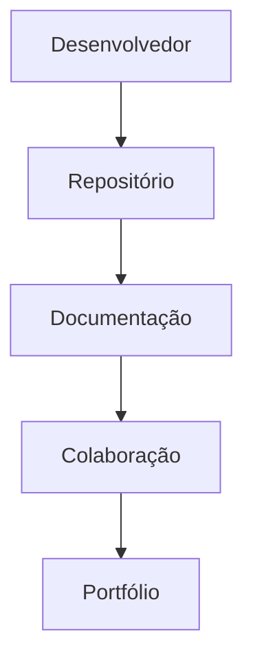

# Aula 02 – GitHub e o Mercado de Trabalho

## 📚 Disciplina

Versionamento de Código com Git e GitHub

## 🎓 Curso

Técnico em Desenvolvimento de Sistemas

## ⏱️ Duração

40 minutos

## 🚀 Projeto Integrador

Meu Manual de Git e GitHub

---

# 🎯 Objetivos da Aula

Ao final desta aula você deverá ser capaz de:

* Compreender o que é o GitHub.
* Entender a diferença entre Git e GitHub.
* Reconhecer o GitHub como uma ferramenta profissional.
* Conhecer o conceito de repositório.
* Identificar como empresas utilizam o GitHub.
* Criar seu primeiro repositório.
* Iniciar oficialmente o Projeto Integrador.

---

# 🔄 Revisão da Aula Anterior

Na Aula 01 aprendemos:

✅ O que é versionamento.

✅ O que é histórico de alterações.

✅ O que é rastreabilidade.

✅ Por que o Git foi criado.

✅ Diferença entre Git e GitHub.

✅ Importância do versionamento no mercado de trabalho.

---

# 🤔 Por Que Aprender Isso?

Imagine que você criou um projeto incrível:

* Um site;
* Um aplicativo;
* Um jogo;
* Um sistema escolar.

Agora surge uma pergunta:

> Onde esse projeto será armazenado?

Outra pergunta:

> Como outras pessoas poderão visualizar seu trabalho?

E mais uma:

> Como uma empresa pode verificar se você realmente sabe desenvolver software?

O Git resolve o problema do versionamento.

O GitHub resolve o problema da colaboração, armazenamento e divulgação dos projetos.

---

# 📖 O Que É o GitHub?

O GitHub é uma plataforma online utilizada para armazenar, compartilhar e colaborar em projetos.

Podemos imaginar o GitHub como uma grande rede social para desenvolvedores.

Enquanto redes sociais tradicionais compartilham:

* Fotos;
* Vídeos;
* Mensagens;

O GitHub compartilha:

* Projetos;
* Sistemas;
* Aplicativos;
* Jogos;
* Documentação.

---

# 📌 Git x GitHub

Uma das maiores dúvidas dos iniciantes.

| Git                      | GitHub                 |
| ------------------------ | ---------------------- |
| Sistema de versionamento | Plataforma online      |
| Instalado no computador  | Acessado pela internet |
| Controla alterações      | Hospeda projetos       |
| Funciona sem internet    | Requer conexão         |

---

# 🧠 O Que É Um Repositório?

Um repositório é um local onde os arquivos de um projeto são armazenados e organizados.

Podemos imaginar um repositório como uma pasta inteligente.

---

## Exemplo

Pasta tradicional:

```text
Projeto/
│
├── index.html
├── style.css
└── script.js
```

---

Repositório GitHub:

```text
Projeto/
│
├── index.html
├── style.css
├── script.js
│
├── histórico
├── autores
├── versões
└── documentação
```

---

# 🌎 O GitHub Está em Todo Lugar

Milhões de desenvolvedores utilizam GitHub diariamente.

Empresas de todos os tamanhos utilizam GitHub para gerenciar seus projetos.

---

## Grandes Empresas

* Google
* Microsoft
* Amazon
* Netflix
* Spotify
* Meta
* IBM
* Oracle

---

## Empresas Brasileiras

* Nubank
* iFood
* Mercado Livre
* Magazine Luiza
* Stone
* Totvs

---

# 💼 GitHub e o Mercado de Trabalho

O GitHub se tornou uma das principais formas de demonstrar conhecimento técnico.

Muitas empresas analisam:

* Perfil GitHub;
* Repositórios;
* Projetos pessoais;
* Documentação;
* Histórico de atividade.

---

## O Que os Recrutadores Observam?

Nem sempre observam apenas código.

Também observam:

✅ Organização.

✅ Documentação.

✅ Participação.

✅ Evolução.

✅ Interesse em aprender.

---

# 👨‍💻 Profissões que Utilizam GitHub

Atualmente o GitHub é utilizado por profissionais de diversas áreas.

---

## Desenvolvimento

* Desenvolvedor Front-end
* Desenvolvedor Back-end
* Desenvolvedor Full Stack
* Desenvolvedor Mobile

---

## Infraestrutura

* DevOps
* SRE
* Administrador de Sistemas

---

## Dados e Inteligência Artificial

* Cientista de Dados
* Engenheiro de Dados
* Engenheiro de IA

---

## Gestão e Arquitetura

* Analista de Sistemas
* Arquiteto de Software
* Líder Técnico

---

# 📊 Como um Perfil GitHub Evolui

Todo profissional começa com poucos projetos.

Exemplo:

```text
Primeiro Dia
│
├── 0 projetos
└── 0 experiência
```

↓

```text
Após alguns meses
│
├── Projetos pessoais
├── Exercícios
├── Documentação
└── Aprendizagem registrada
```

↓

```text
Portfólio Profissional
│
├── Repositórios
├── Projetos
├── Contribuições
└── Histórico de evolução
```

---

# 🏗️ Projeto Integrador

Nesta aula iniciaremos oficialmente o projeto:

# 🚀 Meu Manual de Git e GitHub

---

## Estrutura Inicial

Crie uma pasta local chamada:

```text
manual-git-github
```

Dentro dela crie:

```text
manual-git-github/
│
├── README.md
│
├── aula01/
│
└── aula02/
```

---

# 📄 O Que É o README?

README é normalmente o primeiro arquivo visualizado em um projeto.

Ele funciona como uma apresentação.

É como a capa de um livro.

---

# 📝 Exemplo Simples de README

```markdown
# Meu Manual de Git e GitHub

Projeto desenvolvido durante a disciplina de Versionamento de Código.

## Autor

Seu Nome
```

---

# ⚙️ Como Funciona Um Projeto no GitHub?



---

# 💡 Dica Profissional

Muitos estudantes acreditam que precisam ter dezenas de projetos para conseguir oportunidades.

Na prática, um repositório organizado e bem documentado costuma impressionar mais do que dezenas de projetos abandonados.

Qualidade é mais importante que quantidade.

---

# 🛠️ Mão na Massa

## Atividade Prática

### Passo 1

Acesse sua conta GitHub.

---

### Passo 2

Observe seu perfil.

Identifique:

* Nome;
* Usuário;
* Foto;
* Biografia.

---

### Passo 3

Crie uma pasta local:

```text
manual-git-github
```

---

### Passo 4

Dentro dela crie:

```text
README.md
```

---

### Passo 5

Crie as pastas:

```text
aula01
aula02
```

---

### Passo 6

No arquivo README.md escreva:

```markdown
# Meu Manual de Git e GitHub

Projeto desenvolvido durante a disciplina de Versionamento de Código com Git e GitHub.

## Autor

Seu Nome
```

---

# 🎯 Resultado Esperado

Ao final da aula você deverá possuir:

✅ Conta GitHub configurada.

✅ Perfil revisado.

✅ Pasta do Projeto Integrador criada.

✅ README criado.

✅ Estrutura inicial organizada.

---

# 🚀 Desafio da Aula

Responda utilizando suas próprias palavras.

### Pergunta 1

Por que o GitHub pode ser considerado uma vitrine profissional?

---

### Pergunta 2

Por que empresas analisam perfis GitHub?

---

### Pergunta 3

O que é um repositório?

---

### Pergunta 4

Qual a diferença entre Git e GitHub?

---

# 📌 Atualizando Meu Manual de Git e GitHub

Ao final da aula sua estrutura deverá estar assim:

```text
manual-git-github/
│
├── README.md
│
├── aula01/
│   └── anotacoes.md
│
└── aula02/
    └── resumo.md
```

---

## Entregáveis da Aula

✔ Conta GitHub configurada.

✔ Perfil revisado.

✔ Pasta do Projeto Integrador criada.

✔ README criado.

✔ Estrutura inicial organizada.

✔ Resumo da Aula 02 produzido.

---

## Evidências de Aprendizagem

O professor deverá conseguir verificar:

* Conta GitHub ativa;
* Estrutura criada;
* README criado;
* Registro das anotações.

---

# 📚 Resumo da Aula

Nesta aula aprendemos:

✅ O que é o GitHub.

✅ O que é um repositório.

✅ Diferença entre Git e GitHub.

✅ Como empresas utilizam GitHub.

✅ Como o GitHub pode funcionar como portfólio.

✅ Profissões que utilizam GitHub.

✅ Como iniciar o Projeto Integrador.

---

# 🔗 Preparando-se Para a Próxima Aula

Na próxima aula aprenderemos:

* O que é Markdown;
* Como criar documentação profissional;
* Como funciona um README;
* Como estruturar conteúdos utilizando Markdown.

Será a aula em que começaremos a produzir documentação técnica de verdade.

---

[⏪ Aula 01 – Por que o Git Existe?](aula01.md) | [🏠 Início](../README.md) | [⏩ Aula 03 – Markdown, README.md e Criação do Manual](aula03.md)
